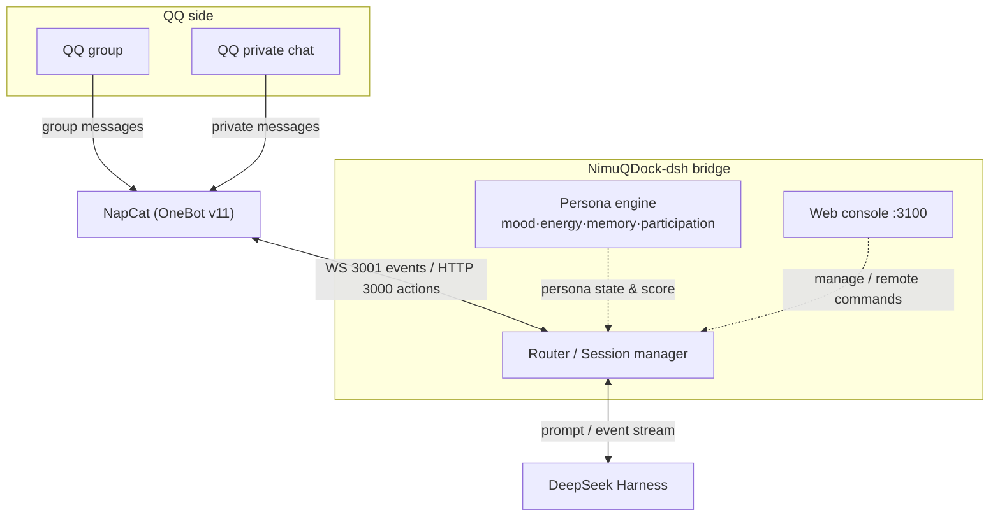
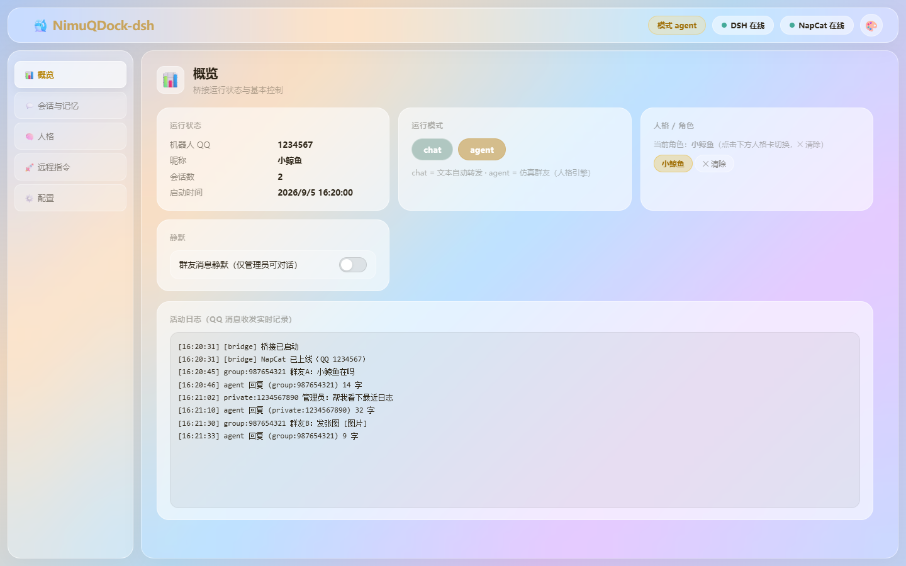
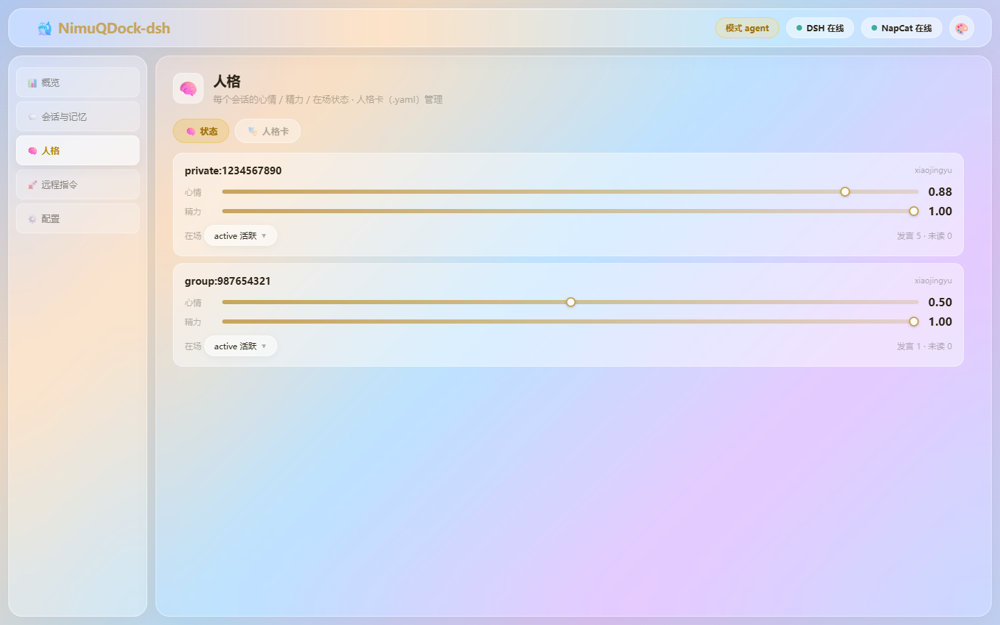
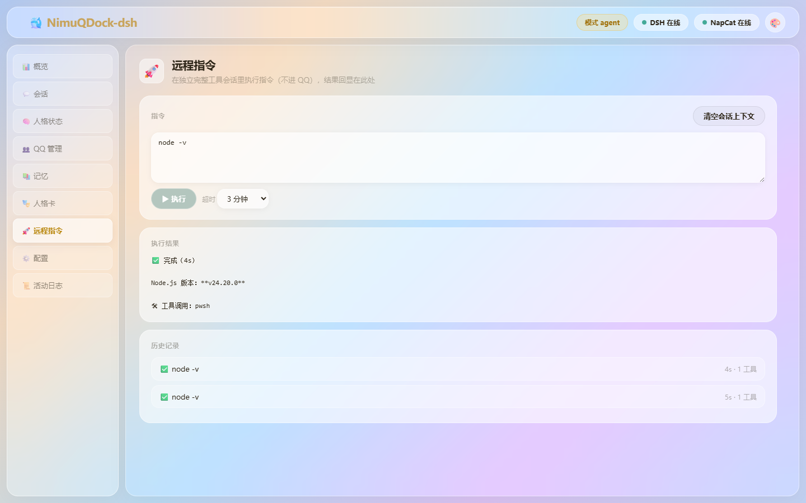
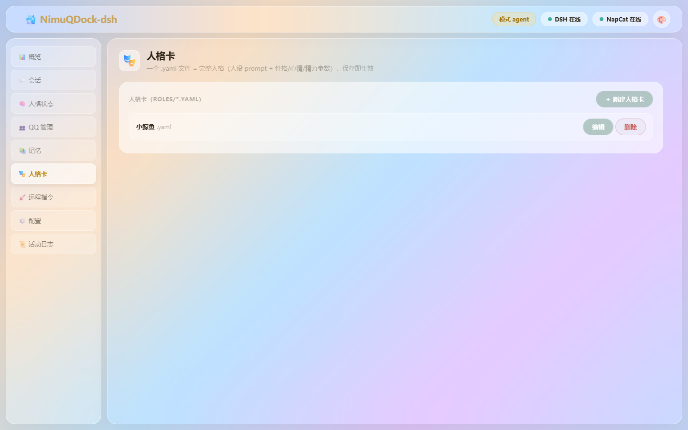

<div align="center">

# 🔌 NimuQDock-dsh

**Dock DeepSeek Harness AI into QQ · A simulated group friend powered by a persona engine — with mood, energy and memory, it dives low and joins in like a real person**

[](https://github.com/NimuStudio/NimuQDock-dsh)
[](https://github.com/NimuStudio/NimuQDock-dsh/blob/main/LICENSE)
[](https://nodejs.org)
[](https://github.com/deepseek-ai/deepseek-harness)
[](https://github.com/NapNeko/NapCatQQ)

[**中文**](README.md) · [**English**](README.en.md)

</div>

---

## What is this

NimuQDock-dsh invites DeepSeek Harness agents into QQ groups and private chats: when someone speaks in a group, it can hear; when it wants to speak up, its reply lands right in the chat. On top of that, the **persona engine** keeps it from being an always-answering customer bot — instead it's a **simulated group friend** with a mood, an energy level, a memory, and a habit of going quiet or bubbling up like a real person.

The journey of a single message:

```
① Someone speaks in QQ (reported by NapCat over the OneBot v11 protocol)
        │
        ▼
② The bridge feeds the message into the matching DSH session
        │
        ▼
③ The agent thinks it through: a reply / a question / a tool approval
        │
        ▼
④ The result goes back to QQ (chat mode replies automatically; agent mode lets the AI send and receive on its own via tools)
```

> In **chat** mode, steps ①–④ run fully automatically. In **agent** mode, the AI reads messages by itself, decides whether to reply, and picks which topics to jump into.

## Architecture



- **QQ side**: NapCat speaks the QQ protocol and reports group/private messages over OneBot v11
- **Bridge process**: routes each message into the matching DSH session; the agent's replies (including questions and tool approvals) go back to QQ
- **Persona engine** (agent mode): computes participation from mood/energy/memory to decide whether to join in
- **Web console**: local management UI — switch modes, tune the persona, manage whitelists, issue remote commands

## Screenshots

| Web console overview | Persona state (agent mode) |
|---|---|
|  |  |

| Remote command panel | Persona card management |
|---|---|
|  |  |

> QQ numbers / group IDs in the screenshots are masked.

## Features

- 🧠 **Persona engine**: mood / energy / relationships evolve with every interaction — getting roasted lowers mood, chatting more deepens bonds, low energy makes it lurk
- 🎯 **Participation model**: not "reply to everything" — a score combining「how directly addressed + topic interest + energy + mood + random noise」must clear a threshold before it joins in; @mentions and direct questions are always answered, casual chatter depends on its state
- 💾 **Layered memory**: rolling group-topic statistics + long-term memory (impressions of group members, unfinished topics), injected by relevance
- 🛡️ **Safety boundary**: QQ sessions physically have no local tools, sending is force-whitelisted, replies containing sensitive info are blocked entirely, and web search ships with SSRF protection
- 🎛️ **Web console** (glassmorphism UI): visualize and tune persona state, manage whitelists, manage persona cards, remote command panel (full-tool session), memory / logs / sessions
- 🚀 **Remote command panel**: sign in to the console and let DSH's full tools (pwsh / files / etc.) run tasks with results echoed back — never touching the QQ transport layer

## One-click install (Windows)

Skip the manual setup: grab an installer from the [Releases](https://github.com/NimuStudio/NimuQDock-dsh/releases) page (all dependencies included, no `npm install` needed):

| Way | Steps |
|---|---|
| **exe installer (recommended)** | download `NimuQDock-dsh-v0.1.2-setup.exe` → double-click → pick a folder → it auto-extracts and runs the setup wizard |
| zip (no install) | download `NimuQDock-dsh-v0.1.2-win-x64.zip` → unzip → double-click `install.bat` |

The wizard checks Node, generates `config.json`, **auto-installs and starts DeepSeek Harness** (version-pinned) and **auto-downloads & extracts NapCat** (CN mirror accelerated). You only have two manual steps: **① install the QQ client ② scan the QR code and configure OneBot11** (the wizard walks you through), then double-click `start.bat` — the web console opens automatically.

> Requires Node.js ≥ 22.13 and an installed QQ client.

## Uninstall

- **exe uninstaller**: download `NimuQDock-dsh-uninstall.exe` (Releases page) → double-click → pick what to remove (project / DeepSeek Harness / NapCat, multi-select).
- **Source users**: double-click `uninstall.bat` inside the project.
- The uninstaller stops a running bridge first, then removes by your selection: the project directory, DSH (npm global package + `~/.dsh`), and NapCat (`NapCatShell/` including QQ login config).

## Getting started

### Prerequisites

| Dependency | Notes |
|---|---|
| Node.js | ≥ 22.13 |
| DeepSeek Harness | see "Install DeepSeek Harness (DSH)" below |
| NapCat | QQ protocol implementation, [download](https://github.com/NapNeko/NapCatQQ/releases/latest) |
| QQ account | one dedicated for the bot (an alt account is recommended) |

### Install DeepSeek Harness (DSH)

The AI runs inside [DeepSeek Harness](https://github.com/deepseek-ai/deepseek-harness), so start it first:

```bash
# Option 1: run on the fly (good for a quick try)
npx @deepseek-ai/dsh web

# Option 2: install globally, then run
npm i -g @deepseek-ai/dsh
dsh web
```

Opening `http://127.0.0.1:3080` in a browser and seeing the DSH UI means it's up. The URL/port is configured in `config.json` under `dsh.baseUrl` (default `http://127.0.0.1:3080`) — keep the two in sync if you change it.

### ① Install dependencies

```bash
npm install
```

### ② Bring NapCat online

> **Which version**: on **Windows** use the **Shell build** (a QQNT client must be installed first; QR-code login). On a **Linux server** use the **Docker image** (it bundles a Linux QQ). The steps below use the Windows Shell build as an example.

1. Download NapCat and follow its official guide to log in with your QQ account (QR-code login; a QQ client must be installed).
2. Open the NapCat WebUI: `http://127.0.0.1:6099/webui` (default password `napcat`).
3. Go to **Network config** and create two connections, with **message format set to `array`** for both:
   - **HTTP server**: `127.0.0.1:3000`
   - **WebSocket server**: `127.0.0.1:3001`
4. If you set an accessToken in the WebUI, note it down and put it into `config.json` next; leaving both empty also works, but they must match.

The generated OneBot11 config lives at `config/onebot11_<QQ号>.json` in the NapCat directory.

### ③ Fill in config.json

```bash
copy config.example.json config.json
```

Key fields:

| Field | Description |
|---|---|
| `dsh.baseUrl` | DSH web service URL, default `http://127.0.0.1:3080` |
| `dsh.provider` / `dsh.model` / `dsh.reasoningEffort` | model provider / model name / reasoning effort (`off`/`low`/`high`/`max`); if your DSH lacks the example model, pick one available in the DSH settings page. **Slow replies? lower the reasoning effort** (`low` is 30–45% faster than `max`, fine for casual chat) |
| `napcat.wsUrl` | NapCat WebSocket server URL, default `ws://127.0.0.1:3001` |
| `napcat.httpUrl` | NapCat HTTP server URL, default `http://127.0.0.1:3000` (**do not use the WS port**) |
| `napcat.accessToken` | must match the accessToken set in the WebUI; leave empty if unset |
| `ownerQQ` | admin QQ number (agent-mode private wake-up, admin actions, etc.) |
| `agentPreset` | DSH agent preset used in chat mode, default `qq-chat` |
| `agentPresetAgent` | DSH agent preset used in agent mode, default `qq-agent` |
| `workspaceTitle` | group name for QQ sessions in the DSH UI, default 「QQ 聊天」 |
| `allow.private` / `allow.groups` | private / group whitelists (arrays of QQ numbers / group IDs), **recommended to fill in first** |
| `deny.private` / `deny.groups` | blacklists, take priority over whitelists |
| `allowAllWhenEmpty` | allow everyone when the whitelist is empty, default `false` (keep it) |
| `ackMessage` | instant acknowledgement text on receiving a message; empty string disables |
| `sendDelayMs` | interval between consecutive QQ sends, to avoid rate limiting |
| `maxReplyChars` | max chars per agent reply, longer replies are split automatically |
| `console.port` / `console.token` | web console port (default `3100`) and access token; if token is empty it is auto-generated and printed at startup |
| `security.interceptNotify` | whether to notify when a reply is blocked by the sensitive-content filter |
| `vision.enabled` / `vision.maxImageBytes` | image-understanding switch and size cap (needs a vision model) |
| `queue.maxPerSession` | max queued messages per session while DSH is offline |
| `social.*` | persona engine tuning (default persona, participation weights, heartbeat, memory, topics) — defaults are fine |

### ④ Install presets and MCP into DSH

```bash
node scripts/setup-dsh.mjs
```

The script installs the `qq-chat` / `qq-agent` agent presets, two MCP servers (safe QQ tools + web search), and a settings-page plugin into the DSH environment, and writes a local `state/mode.json` fallback. It is idempotent; **re-run it after moving the project directory** (MCP/plugin paths are absolute). **Restart DSH** afterwards for it to take effect.

### ⑤ Start

```bash
npm start
# or double-click start.bat (watchdog mode: auto-restarts 5s after a crash)
```

Success looks like the log showing `配置已加载` → `DSH 已连接` → `NapCat 已连接` → `桥接已启动` in order.

> Note: only one bridge instance may run (single-instance lock). If you see 「已有实例在运行」, double-click `restart.bat` or delete `state/bridge.lock`.

### Verify & daily use

- **Private-message** the bot or **@ it in a group** and see if it replies.
- Open the web console at `http://127.0.0.1:3100` (token printed at startup): check status, switch **chat / agent** mode, tune the persona, manage whitelists, issue remote commands.
- **agent** mode = simulated group friend: the AI watches messages on its own and decides whether to join based on its persona; private chats in agent mode only respond to `ownerQQ`.
- Restarting DSH does not require restarting the bridge: the bridge probes DSH automatically, queues messages while DSH is offline, and replays them once it recovers.

### Configure persona cards (roleplay)

- In the console under **🧠 Persona → Persona cards**, you can **create / edit** `roles/*.yaml`: one file = one complete persona, and saving takes effect immediately (the cache is cleared automatically).
  The `prompt` field is the persona text (identity, speech style, pet peeves injected into the AI); the other fields (mood / energy / interests / proactiveness) drive the persona engine.
- **chat mode** role switch: in the console under **📊 Overview → Persona / role**, click a persona card (group members cannot change it).
- **agent mode** default persona: edit `social.defaultPersona` in `config.json` (e.g. `小鲸鱼`), save, and restart the bridge.

### Offline self-tests (no QQ needed)

```bash
npm run self-test        # bridge ↔ DSH connection link
npm run test-loop        # chat loop (real DSH + fake QQ)
npm run test-loop -- --mode agent   # agent loop (wake / dive)
npm run test-persona     # persona engine unit tests
npm run test-agent-api   # agent internal API
npm run test-mcp-web     # SSRF-protected search
npm run test-onebot      # NapCat connection
```

## Troubleshooting

| Symptom | Fix |
|---|---|
| HTTP 426 (Upgrade Required) | `napcat.httpUrl` points at the WebSocket port; check that ports match between config.json and `onebot11_<QQ号>.json` |
| @ in group gets no reply | is the group ID in the `allow.groups` whitelist? in agent mode, it may simply be lurking (participation score below threshold) |
| Private chat gets no reply | check `allow.private`; agent mode only responds to `ownerQQ` in private chats |
| MCP or preset changes don't take effect | MCP servers are spawned by DSH — **restart DSH** after editing `src/mcp/*.js` or `dsh/agent-presets/` |
| 「已有实例在运行」 (instance already running) | stale single-instance lock; double-click `restart.bat` or delete `state/bridge.lock` |
| Model selection fails | set `dsh.model` to a model actually available in the DSH settings page |

## Feature matrix

| Feature | Description |
|---|---|
| chat mode | Text auto-forwarding, safe chatting |
| agent mode | Simulated group friend: persona engine + participation + tool-driven send/receive |
| Persona engine | Mood / energy / relationship / presence evolve (persisted) |
| Layered memory | Group topics + long-term memory injected by relevance |
| Active heartbeat | Persona-driven "take a look at the group once in a while" |
| Web console | Status / mode / persona tuning / persona cards / memory / remote commands / whitelist / logs |
| Remote commands | Full-tool session execution with echoed results |
| Safe MCP | Whitelisted sending + SSRF-protected search |

## Project structure

| Directory | Purpose |
|---|---|
| `src/transport/` | NapCat OneBot11 client, DSH WebSocket downlink client |
| `src/core/` | Session management / message routing / send chain / event pump / turn collection |
| `src/persona/` | Persona engine: state / memory / engagement / lexicon / tokens |
| `src/mcp/` | Safe QQ tools MCP + SSRF-protected search MCP |
| `src/console/` | Web console + `/agent/v1` internal API |
| `dsh/` | DSH agent presets (qq-chat / qq-agent) |
| `roles/` | Persona cards (YAML, persona text embedded in `prompt`) |
| `scripts/` | Setup / test scripts |
| `docs/` | Architecture & implementation specs (DESIGN.md / PERSONA_ENGINE.md) |

## Discussion

💬 Questions or want to chat? Head over to [GitHub Discussions](https://github.com/NimuStudio/NimuQDock-dsh/discussions).

## Ecosystem

- 🎨 The console's glassmorphism UI comes from [**Nimu Glass UI**](https://github.com/NimuStudio/Nimu-glass-ui) (a three-theme glassmorphism UI system)
- ⚡ Need lightweight WebSocket messaging? Check out [**NimuChat**](https://github.com/NimuStudio/NimuChat)

## Supporters

Thanks to everyone keeping this project alive ❤️

| Supporter | Tier | Date |
|---|---|---|
| Your name here ⭐ | Supporter ¥18 | — |

> Want to support this project? ☕ [Buy me a coffee on Aifadian](https://ifdian.net/a/NimuStudio). Names (GitHub username or nickname) from the **¥18 Supporter tier** are permanently listed in the table above.

## Support

Like this project? ☕ [Buy me a coffee on Aifadian](https://ifdian.net/a/NimuStudio)

## Disclaimer

The QQ protocol layer is provided by the third-party open-source project NapCat, which has no affiliation with Tencent or its products. This project is for learning and technical research only — please review and comply with the relevant terms and the QQ User Agreement before using it.

Also note: connecting an agent to QQ means handing your account's voice to a model. Please configure the whitelist (`allow.private` / `allow.groups`) before using it with anyone, and weigh the risks carefully.

## License

[MIT](LICENSE)
