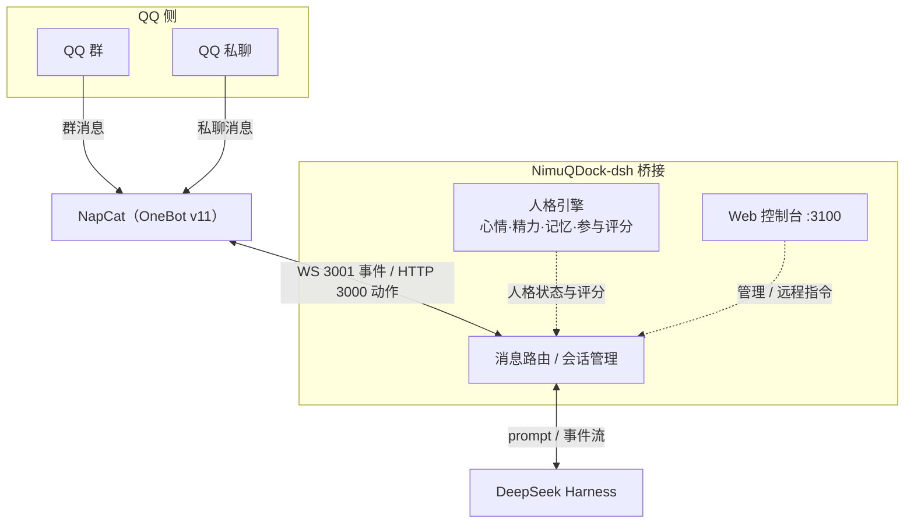

<div align="center">

# 🔌 NimuQDock-dsh

**把 DeepSeek Harness 的 AI 停靠进 QQ 的对接坞 · 带人格引擎的仿真群友：心情、精力、记忆，像真人一样潜水与参与**

[](https://github.com/NimuStudio/NimuQDock-dsh)
[](https://github.com/NimuStudio/NimuQDock-dsh/blob/main/LICENSE)
[](https://nodejs.org)
[](https://github.com/deepseek-ai/deepseek-harness)
[](https://github.com/NapNeko/NapCatQQ)

[**中文**](README.md) · [**English**](README.en.md)

</div>

---

## 这是什么

NimuQDock-dsh 把 DeepSeek Harness 的 agent 请进 QQ 群和私聊：群里有人说话，它就能听见；它想开口时，回复会出现在群里。在此基础上，**人格引擎**让它不是有问必答的客服，而是一个有心情、有精力、有记忆、会潜水也会冒泡的**仿真群友**。

一条消息的旅程：

```
① 群友在 QQ 发言（NapCat 以 OneBot v11 协议上报）
        │
        ▼
② 桥接进程把消息投入对应的 DSH 会话
        │
        ▼
③ agent 思考完毕：产出回复 / 提问 / 工具审批
        │
        ▼
④ 结果发回 QQ（chat 模式自动回；agent 模式由 AI 用工具自主收发）
```

> chat 模式：①②③④ 全自动；agent 模式：AI 自己看消息、自己决定回不回、自己挑话题接。

## 架构



- **QQ 侧**：NapCat 负责接入 QQ 协议，把群/私聊消息以 OneBot v11 协议上报
- **桥接进程**：收到消息后路由到对应 DSH 会话；agent 的回复（含提问、工具审批）原路发回 QQ
- **人格引擎**（agent 模式）：用心情/精力/记忆计算参与意愿，决定"这条要不要接"
- **Web 控制台**：本地管理界面，可切换模式、调人格、管白名单、发远程指令

## 截图

| Web 控制台概览 | 人格状态（agent 模式） |
|---|---|
|  |  |

| 远程指令面板 | 人格卡管理 |
|---|---|
|  |  |

> 截图中的 QQ 号/群号已打码。

## 特性

- 🧠 **人格引擎**：心情 / 精力 / 与群友的关系随互动演化，被怼心情下降、聊得多关系变熟、精力低了倾向潜水
- 🎯 **参与意愿模型**：不是"每条都回"，而是按「被点名程度 + 话题兴趣 + 精力 + 心情 + 随机扰动」评分，超过阈值才参与——被 @/提问必回，普通闲聊按状态决定
- 💾 **分层记忆**：群话题滚动统计 + 长期记忆（对群友的印象、没聊完的话题），按相关性自动注入
- 🛡️ **安全边界**：QQ 会话物理上没有本地工具、发送强制白名单、回复敏感信息整条拦截、联网搜索带 SSRF 防护
- 🎛️ **Web 控制台**（玻璃拟态 UI）：人格状态可视化调节、白名单管理、角色卡管理、远程指令面板（完整工具会话）、记忆/日志/会话管理
- 🚀 **远程指令面板**：登录控制台即可让 DSH 的完整工具（pwsh/文件等）执行任务，结果回显——不经 QQ 传输层

## 一键安装（Windows）

不想手动折腾？去 [Releases](https://github.com/NimuStudio/NimuQDock-dsh/releases) 下载安装包（均含全部依赖，无需 npm install）：

| 方式 | 操作 |
|---|---|
| **exe 安装器（推荐）** | 下载 `NimuQDock-dsh-v0.1.2-setup.exe` → 双击 → 选目录 → 自动解压并运行安装向导 |
| zip 免安装 | 下载 `NimuQDock-dsh-v0.1.2-win-x64.zip` → 解压 → 双击 `install.bat` |

安装向导会自动：检查 Node / 生成 config.json / **自动安装并启动 DeepSeek Harness**（锁版本）/ **自动下载解压 NapCat**（国内镜像加速）。你只需要两件手动事：**① 安装 QQ 客户端 ② 扫码登录并配置 OneBot11**（向导会一步步提示），最后双击 `start.bat` 启动，浏览器自动打开 Web 控制台。

> 需要 Node.js ≥ 22.13 和已安装的 QQ 客户端。

## 卸载

- **exe 卸载程序**：下载 `NimuQDock-dsh-uninstall.exe`（Releases 页）→ 双击 → 勾选要卸载的内容（项目 / DeepSeek Harness / NapCat，可多选）。
- **源码用户**：双击项目里的 `uninstall.bat`。
- 卸载程序会先停止运行中的桥接，再按选择删除：项目目录、DSH（npm 全局包 + `~/.dsh`）、NapCat（`NapCatShell/` 及 QQ 登录配置）。

## 开始使用

### 需要准备

| 依赖 | 说明 |
|---|---|
| Node.js | ≥ 22.13 |
| DeepSeek Harness | 见下方「先装好 DeepSeek Harness」 |
| NapCat | QQ 协议实现，[下载](https://github.com/NapNeko/NapCatQQ/releases/latest) |
| QQ 账号 | 一个用于机器人的 QQ 号（建议小号） |

### 先装好 DeepSeek Harness（DSH）

本项目把 AI 放在 [DeepSeek Harness](https://github.com/deepseek-ai/deepseek-harness) 里运行，需要先把它启动起来：

```bash
# 方式一：临时运行（想先试试就用这个）
npx @deepseek-ai/dsh web

# 方式二：全局安装后运行
npm i -g @deepseek-ai/dsh
dsh web
```

浏览器打开 `http://127.0.0.1:3080` 能看到 DSH 界面即成功。DSH 的地址/端口在 `config.json` 的 `dsh.baseUrl` 配置（默认 `http://127.0.0.1:3080`），改了地址就同步改这里。

### ① 安装依赖

```bash
npm install
```

### ② 让 NapCat 上线

> **版本选择**：**Windows** 用 **Shell 版**（需先安装 QQ 客户端 QQNT，扫码登录）；**Linux 服务器**用 **Docker 版**（镜像自带 Linux QQ）。以下步骤以 Windows Shell 版为例。

1. 下载 NapCat 并按官方教程把它接入你的 QQ 账号（扫码登录，会要求已安装 QQ 客户端）。
2. 打开 NapCat WebUI：`http://127.0.0.1:6099/webui`（默认口令 `napcat`）。
3. 进入 **网络配置**，新建两个连接，**消息格式都选 `array`**：
   - **HTTP 服务端**：`127.0.0.1:3000`
   - **WebSocket 服务端**：`127.0.0.1:3001`
4. 如果在 WebUI 里设置了 accessToken，记下来，下一步填进 `config.json`；两边都留空也可以，但必须一致。

生成的 OneBot11 配置在 NapCat 目录的 `config/onebot11_<QQ号>.json`。

### ③ 填写 config.json

```bash
copy config.example.json config.json
```

主要字段：

| 字段 | 说明 |
|---|---|
| `dsh.baseUrl` | DSH Web 服务地址，默认 `http://127.0.0.1:3080` |
| `dsh.provider` / `dsh.model` / `dsh.reasoningEffort` | 模型供应商 / 模型名 / 推理强度（`off`/`low`/`high`/`max`）；若你的 DSH 没有示例中的模型，改成 DSH 设置页里可用的即可。**回复慢就调低推理强度**（`low` 比 `max` 快 30%~45%，闲聊足够） |
| `napcat.wsUrl` | NapCat WebSocket 服务端地址，默认 `ws://127.0.0.1:3001` |
| `napcat.httpUrl` | NapCat HTTP 服务端地址，默认 `http://127.0.0.1:3000`（**别填成 WS 端口**） |
| `napcat.accessToken` | 与 WebUI 里设置的 accessToken 一致，未配置留空 |
| `ownerQQ` | 管理员 QQ 号（agent 模式的私聊唤醒、管理操作等） |
| `agentPreset` | chat 模式使用的 DSH agent preset，默认 `qq-chat` |
| `agentPresetAgent` | agent 模式使用的 DSH agent preset，默认 `qq-agent` |
| `workspaceTitle` | QQ 会话在 DSH 界面里的归组名称，默认「QQ 聊天」 |
| `allow.private` / `allow.groups` | 私聊 / 群聊白名单（QQ 号 / 群号数组），**建议先填上** |
| `deny.private` / `deny.groups` | 黑名单，优先级高于白名单 |
| `allowAllWhenEmpty` | 白名单为空时是否放行全部，默认 `false`（保持默认） |
| `ackMessage` | 收到消息后的即时回复文本，空字符串关闭 |
| `sendDelayMs` | QQ 连续发送间隔，防止触发频率限制 |
| `maxReplyChars` | agent 单条回复最大字符数，超出自动分段 |
| `console.port` / `console.token` | Web 控制台端口（默认 `3100`）与访问令牌；token 留空则启动时自动生成并打印 |
| `security.interceptNotify` | 回复被敏感拦截时是否提示 |
| `vision.enabled` / `vision.maxImageBytes` | 图片理解开关与大小上限（需 vision 模型） |
| `queue.maxPerSession` | DSH 掉线期间每会话缓存的消息条数上限 |
| `social.*` | 人格引擎参数（默认人格、参与评分权重、心跳、记忆、话题窗口），一般保持默认 |

### ④ 给 DSH 装 preset 和 MCP

```bash
node scripts/setup-dsh.mjs
```

脚本会把 `qq-chat` / `qq-agent` 两套 agent preset、两个 MCP server（QQ 安全工具 + 联网搜索）和一个设置页插件装进 DSH 环境，并写入本地 `state/mode.json` 兜底。可重复运行；**移动过项目目录后必须重跑**（MCP/插件路径是绝对路径）。装完**重启 DSH** 生效。

### ⑤ 启动

```bash
npm start
# 或双击 start.bat（守护模式：崩溃后 5 秒自动拉起）
```

日志依次出现 `配置已加载` → `DSH 已连接` → `NapCat 已连接` → `桥接已启动` 即成功。

> 提示：桥接只能跑一个实例（单实例锁）。出现「已有实例在运行」时双击 `restart.bat` 一键重启，或手动删除 `state/bridge.lock`。

### 验证与日常使用

- 给机器人**私聊**或**群里 @ 它**，看它是否回复。
- 打开 Web 控制台 `http://127.0.0.1:3100`（令牌在启动日志里）：查看状态、切换 **chat / agent** 模式、调节人格、管理白名单、发远程指令。
- agent 模式 = 仿真群友：AI 主动看消息、按人格决定参不参与；agent 模式私聊只响应 `ownerQQ`。
- 重启 DSH 不需要动桥接：桥接会自动探活，DSH 掉线期间的消息会入队缓存，恢复后自动补投。

### 配置人格卡（角色扮演）

- 控制台「🧠 人格 → 人格卡」页可**新建 / 编辑** `roles/*.yaml`：一个文件 = 一个完整人格，保存即生效（自动清缓存）。
  `prompt` 字段就是人设文本（注入给 AI 的身份、说话风格、雷点）；其余字段（心情/精力/兴趣/参与度）驱动人格引擎。
- **chat 模式**切换角色：控制台「📊 概览 → 人格 / 角色」点人格卡即可（群友无法更改）。
- **agent 模式**默认人格：改 `config.json` 的 `social.defaultPersona`（如 `小鲸鱼`），保存后重启桥接生效。

### 离线自测（不需要 QQ）

```bash
npm run self-test        # 桥接与 DSH 的连接链路
npm run test-loop        # chat 闭环（真实 DSH + 假 QQ）
npm run test-loop -- --mode agent   # agent 闭环（唤醒/潜水）
npm run test-persona     # 人格引擎单测
npm run test-agent-api   # agent 内部 API
npm run test-mcp-web     # SSRF 防护搜索
npm run test-onebot      # NapCat 连接
```

## 常见问题

| 现象 | 处理 |
|---|---|
| HTTP 426（Upgrade Required） | `napcat.httpUrl` 填成了 WebSocket 端口；检查 config.json 与 `onebot11_<QQ号>.json` 的端口是否一致 |
| 群里 @ 没反应 | 群号是否在白名单 `allow.groups`；agent 模式下检查它是不是在潜水（参与评分没过阈值） |
| 私聊没反应 | 私聊白名单 `allow.private`；agent 模式只响应 `ownerQQ` |
| 改了 MCP 或 preset 不生效 | MCP 由 DSH 拉起，改 `src/mcp/*.js` 或 `dsh/agent-presets/` 后要**重启 DSH** |
| 提示「已有实例在运行」 | 单实例锁残留，双击 `restart.bat` 或删 `state/bridge.lock` |
| 模型选择失败 | `dsh.model` 改成 DSH 设置页里实际可用的模型 |

## 能力一览

| 功能 | 说明 |
|---|---|
| chat 模式 | 文本自动转发，安全聊天 |
| agent 模式 | 仿真群友：人格引擎 + 参与意愿 + 工具自主收发 |
| 人格引擎 | 心情/精力/关系/在场状态演化（持久化） |
| 分层记忆 | 群话题 + 长期记忆按相关性注入 |
| 主动心跳 | 人格驱动"偶尔看看群" |
| Web 控制台 | 状态/模式/人格调节/角色卡/记忆/远程指令/白名单/日志 |
| 远程指令 | 完整工具会话执行，结果回显 |
| 安全 MCP | 白名单发送 + SSRF 防护搜索 |

## 项目结构

| 目录 | 作用 |
|---|---|
| `src/transport/` | NapCat OneBot11 客户端、DSH WebSocket 下行客户端 |
| `src/core/` | 会话管理 / 消息路由 / 发送链 / 事件泵 / turn 收集 |
| `src/persona/` | 人格引擎：状态 / 记忆 / 参与度 / 词库 / 令牌 |
| `src/mcp/` | 安全 QQ 工具 MCP + SSRF 防护搜索 MCP |
| `src/console/` | Web 控制台 + `/agent/v1` 内部 API |
| `dsh/` | DSH 端 agent preset（qq-chat / qq-agent） |
| `roles/` | 人格卡（YAML，prompt 内嵌人设） |
| `scripts/` | 安装 / 测试脚本 |
| `docs/` | 架构与实现规格（DESIGN.md / PERSONA_ENGINE.md） |

## 讨论

💬 有问题或想交流？欢迎来 [GitHub Discussions](https://github.com/NimuStudio/NimuQDock-dsh/discussions) 聊聊。

## 配套组件

- 🎨 控制台的玻璃拟态 UI 来自 [**Nimu Glass UI**](https://github.com/NimuStudio/Nimu-glass-ui)（三主题玻璃拟态 UI 体系）
- ⚡ 需要轻量 WebSocket 通讯？[**NimuChat**](https://github.com/NimuStudio/NimuChat)

## 支持者

感谢以下支持者让这个项目持续下去 ❤️

| 支持者 | 赞助档位 | 日期 |
|---|---|---|
| 等你来 ⭐ | 支持者 ¥18 | — |

> 想支持这个项目？☕ [去爱发电请我喝杯咖啡](https://ifdian.net/a/NimuStudio)。**¥18 支持者档**支持者的名字（GitHub 用户名或昵称）会永久列入上表。

## 支持

喜欢这个项目？☕ [去爱发电请我喝杯咖啡](https://ifdian.net/a/NimuStudio)

## 使用提醒

QQ 协议层由第三方开源项目 NapCat 提供，与腾讯公司及其产品无任何隶属关系；本项目仅用于学习与技术研究，请在使用前自行了解并遵守相关条款与《QQ 用户协议》。

另外请注意：把 agent 接进 QQ，等于把账号的发言权交给了模型。对外使用前请务必先配置好白名单（`allow.private` / `allow.groups`），谨慎评估风险。

## 许可证

[MIT](LICENSE)
